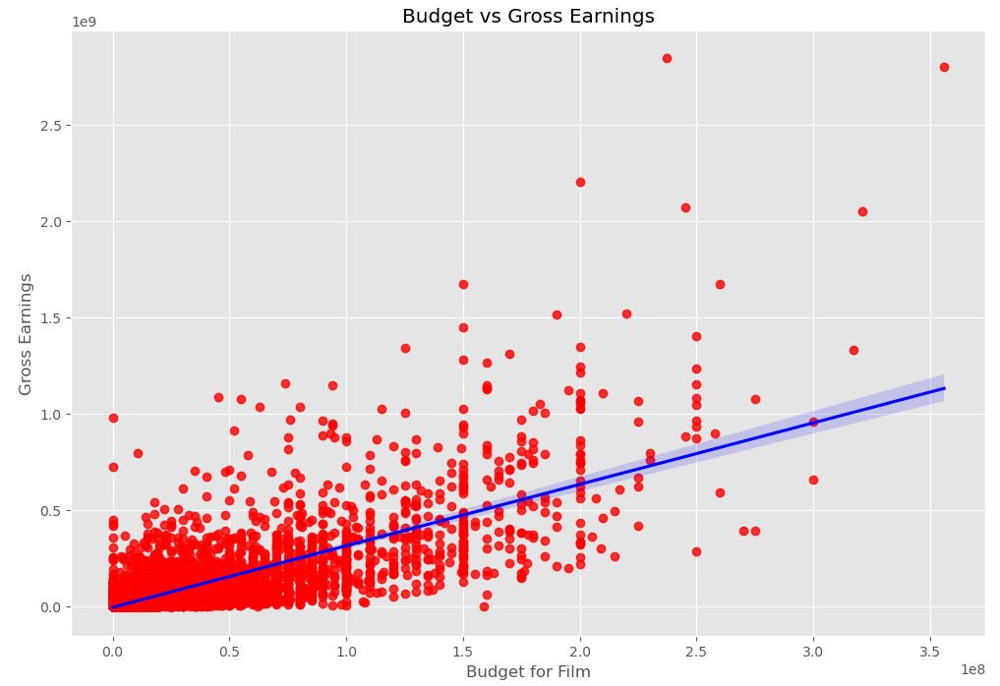
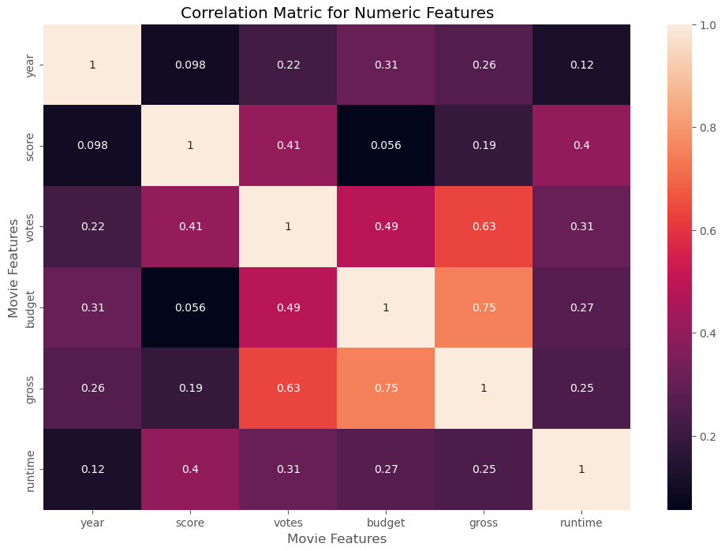
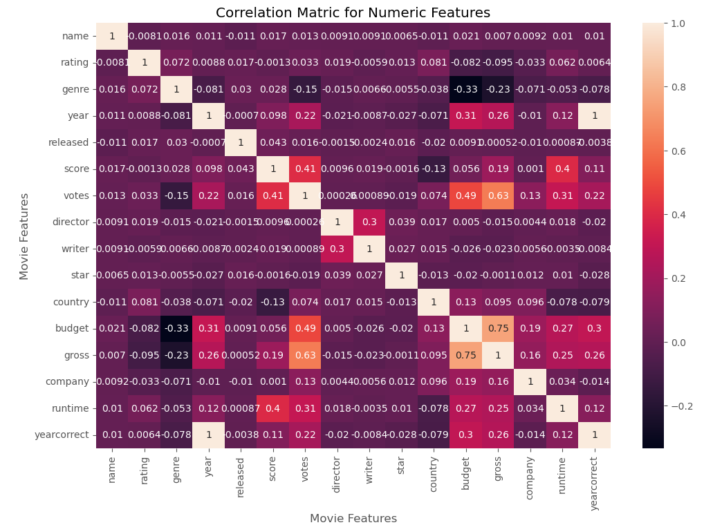
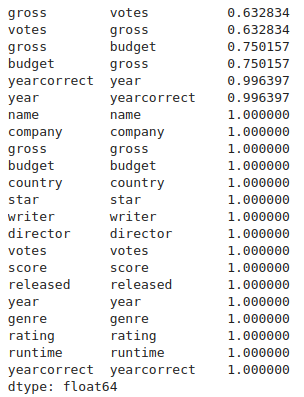

# Correlation in Python

This portfolio project showcases my data cleaning and analysis skills using popular Python libraries 
such as Pandas, Seaborn, and Matplotlib. The project focuses on analyzing a movie dataset to uncover 
insights and correlations.

## Table of Contents
- [Project Overview](#project-overview)
- [Data Sources](#data-sources)
- [Tools and Technologies](#tools-and-technologies)
- [Data Cleaning](#data-cleaning)
- [Finding Correlations](#finding-correlations)
- [Conclusion](#conclusion)

## Project Overview

This project involves:
1. Cleaning and transforming movie data.
2. Analyzing data to find correlations between different movie features.
3. Using Python libraries for data visualization and analysis.

## Data Sources

- **Movie Dataset**: Downloaded from [Kaggle](https://www.kaggle.com/datasets/danielgrijalvas/movies).

## Tools and Technologies

- **Pandas**: Library for data manipulation and analysis.
- **NumPy**: Library for numerical computing.
- **Seaborn**: Statistical data visualization library based on Matplotlib.
- **Matplotlib**: Library for creating static, animated, and interactive visualizations.

## Data Cleaning

### Check for Missing Data
Use a for loop to check for missing data in each column:
```python
# Checking for missing data
for col in movieData.columns:
    percentage_missing = np.mean(movieData[col].isnull())
    print('{} - {}%'.format(col, round(percentage_missing * 100, 2)))
```

### Correct 'Gross' and 'Budget' Columns
Fill NaN values with 0 and convert columns from float64 to int64:
```python
# Change data of 'gross' and 'budget'

# Fill NaNs with 0
movieData['budget'] = movieData['budget'].fillna(0)
movieData['gross'] = movieData['gross'].fillna(0)

# Convert columns from float64 to int64
movieData['budget'] = movieData['budget'].astype('int64')
movieData['gross'] = movieData['gross'].astype('int64')

# Verify the changes
print("\nData types after conversion:")
print(movieData.dtypes)
```

### Standardize 'Year' and 'Released' Columns
Extract the year from the 'released' column and overwrite the value in the 'year' column:
```python
# Fill NaN values with an empty string
movieData['released'] = movieData['released'].fillna('')

# Extract the year from the 'released' column using a regular expression
movieData['yearcorrect'] = movieData['released'].apply(lambda x: re.search(r'\d{4}', str(x)).group() if re.search(r'\d{4}', str(x)) else None)
```

## Finding Correlations
### Scatter Plot of Budget vs Gross


### Regression Plot
Add a regression line to the scatter plot to show correlation:


### Correlation Matrix Heatmap
Create a heatmap to show correlations between numeric features:


### Correlation Matrix for All Features
Create a heatmap matrix for all features:


### High Correlation Pairs
Identify and display high correlation pairs:



## Conclusion
This project demonstrates my ability to clean, analyze, and visualize data using popular Python libraries 
such as Pandas, Seaborn, and Matplotlib. The steps taken ensure that the movie dataset is accurate, 
standardized, and ready for analysis, and the findings highlight important correlations between various movie features.
